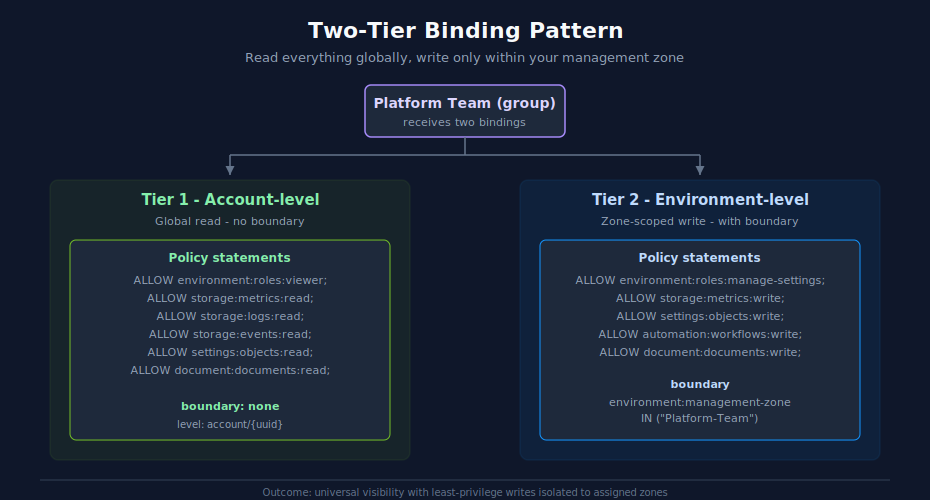

# dtiam

**Dynatrace IAM, one command away.**

`dtiam` is a kubectl-inspired CLI for managing Dynatrace Identity and Access Management resources. Manage groups, users, policies, bindings, boundaries, and more from your terminal.

```bash
dtiam get groups                              # List all groups
dtiam describe group "DevOps Team"            # Detailed group view
dtiam create binding --group DevOps --policy admin  # Assign policy to group
dtiam analyze user-permissions admin@co.com   # Effective permissions
dtiam bulk add-users-to-group -f users.csv    # Bulk operations
```

> **DISCLAIMER:** This tool is provided "as-is" without warranty. It is **NOT produced, endorsed, or supported by Dynatrace**. For official tools, visit [dynatrace.com](https://www.dynatrace.com).

**[Quick Start](docs/QUICK_START.md)** · **[Command Reference](docs/COMMANDS.md)** · **[Architecture](docs/ARCHITECTURE.md)** · **[API Reference](docs/API_REFERENCE.md)**

---

## Install

```bash
# From source
git clone https://github.com/timstewart-dynatrace/GO-dtiam.git
cd GO-dtiam && make build

# Or install to $GOPATH/bin
make install
```

Binary downloads available on the [releases page](https://github.com/timstewart-dynatrace/GO-dtiam/releases).

**Requires:** Go 1.22+ (building from source), Dynatrace account with API access.

## Authenticate

```bash
# OAuth2 (recommended - tokens auto-refresh)
dtiam config set-credentials prod --client-id YOUR_ID --client-secret YOUR_SECRET
dtiam config set-context prod --account-uuid YOUR_UUID --credentials-ref prod
dtiam config use-context prod

# Or use environment variables
export DTIAM_CLIENT_SECRET="dt0s01.CLIENTID.SECRET"
export DTIAM_ACCOUNT_UUID="abc-123-def"

# Bearer token (quick testing only - no auto-refresh)
export DTIAM_BEARER_TOKEN="dt0c01.XXXXX.YYYYY..."
export DTIAM_ACCOUNT_UUID="abc-123-def"
```

Multi-context configuration and scope requirements are covered in the **[Quick Start Guide](docs/QUICK_START.md)**.

## Why dtiam?

- **Familiar CLI conventions**: `get`, `describe`, `create`, `delete`. If you know `kubectl`, you already know dtiam
- **Multi-context**: Switch between accounts with a single command; named contexts with separate credentials
- **Permissions analysis**: Calculate effective permissions, generate matrices, check least-privilege compliance
- **Bulk operations**: Process users, groups, and bindings from CSV/YAML/JSON files
- **Machine-friendly**: `--plain` mode forces JSON output with no colors for scripting and automation
- **Dry-run support**: Preview all mutating operations before executing them
- **First-class two-tier access control**: `create binding` + `boundary create-mz-boundary` compose into the least-privilege pattern shown below



<!-- MARKDOWN_TABLE_ALTERNATIVE
| Tier | Level | Permissions | Boundary |
|------|-------|-------------|----------|
| 1 | `account/{uuid}` | `environment:roles:viewer`, `storage:*:read`, `settings:objects:read`, `document:documents:read` | none (global) |
| 2 | `environment/{envId}` | `environment:roles:manage-settings`, `storage:metrics:write`, `settings:objects:write`, `automation:workflows:write`, `document:documents:write` | `environment:management-zone IN ("Platform-Team")` |

Outcome: universal read visibility, writes isolated to the group's assigned management zone.
-->


## Supported Resources

| Resource | Operations |
|----------|------------|
| Groups | get, describe, create, delete, members, add-member, remove-member, bindings |
| Users | get, describe, create, delete, add-to-groups, remove-from-groups, replace-groups |
| Service Users | list, get, create, update, delete, add-to-group, remove-from-group |
| Policies | get, describe, create, delete (account, environment, global levels) |
| Bindings | get, create, delete (with boundary support) |
| Boundaries | get, describe, create, delete, attach, detach, list-attached |
| Environments | get, describe |
| Limits | account limits, account check-capacity |
| Subscriptions | account subscriptions, account forecast |
| Platform Tokens | get, create, delete |
| Apps | get (requires --environment) |
| Schemas | get, search (requires --environment) |

### Templates & Declarative Apply

| Command | Description |
|---------|-------------|
| `template list` | List built-in and custom templates |
| `template render NAME --set key=value` | Render a template with variables |
| `template apply NAME --set key=value` | Create a resource from a template |
| `apply -f resource.yaml` | Declarative resource creation from YAML/JSON |

### Bulk & Analysis

| Command | Description |
|---------|-------------|
| `bulk add-users-to-group` | Add users from CSV/YAML/JSON file |
| `bulk create-groups` | Create multiple groups from file |
| `bulk create-bindings` | Create bindings from file |
| `bulk create-groups-with-policies` | Create groups + bind policies in one step |
| `export all` | Export all IAM resources for backup |
| `analyze user-permissions` | Calculate effective user permissions |
| `analyze permissions-matrix` | Generate permissions matrix |
| `analyze least-privilege` | Identify excessive permissions |

See the **[Command Reference](docs/COMMANDS.md)** for the full list of verbs, flags, and examples.

## Global Options

```
-c, --context     Override the current context
-o, --output      Output format: table, json, yaml, csv, wide (default: table)
-v, --verbose     Enable verbose/debug output
    --plain       Plain mode: JSON output, no colors, no prompts
    --dry-run     Preview changes without applying them
-V, --version     Show version and exit
```

## Configuration

Config file: `~/.config/dtiam/config` (XDG Base Directory compliant)

```yaml
api-version: v1
kind: Config
current-context: production
contexts:
  - name: production
    context:
      account-uuid: abc-123-def
      credentials-ref: prod-creds
credentials:
  - name: prod-creds
    credential:
      client-id: dt0s01.XXXXX
      client-secret: dt0s01.XXXXX.YYYYY
```

| Variable | Description |
|----------|-------------|
| `DTIAM_BEARER_TOKEN` | Static bearer token (alternative to OAuth2) |
| `DTIAM_CLIENT_ID` | OAuth2 client ID (optional - auto-extracted from secret) |
| `DTIAM_CLIENT_SECRET` | OAuth2 client secret (format: `dt0s01.CLIENTID.SECRET`) |
| `DTIAM_ACCOUNT_UUID` | Dynatrace account UUID |
| `DTIAM_CONTEXT` | Override current context name |
| `DTIAM_OUTPUT` | Default output format |
| `DTIAM_VERBOSE` | Enable verbose mode |

## Required OAuth2 Scopes

| Scope | Operations |
|-------|------------|
| `account-idm-read` | List/get groups, users, service users, limits |
| `account-idm-write` | Create/delete groups, users, service users |
| `account-env-read` | List environments |
| `iam-policies-management` | Full policy, binding, and boundary management |
| `iam:effective-permissions:read` | Effective permissions analysis |

**Read-only:** `account-idm-read`, `account-env-read`, `iam:policies:read`, `iam:bindings:read`, `iam:boundaries:read`

**Full management:** `account-idm-read`, `account-idm-write`, `account-env-read`, `iam-policies-management`

## Building

```bash
make build       # Build binary to bin/dtiam
make test        # Run all tests
make lint        # Run golangci-lint
make install     # Install to $GOPATH/bin
make build-all   # Build for all platforms
```

## Documentation

- [Quick Start](docs/QUICK_START.md) - Authentication, first commands, common patterns
- [Command Reference](docs/COMMANDS.md) - All verbs, flags, resource types, and examples
- [Architecture](docs/ARCHITECTURE.md) - Technical design and implementation
- [API Reference](docs/API_REFERENCE.md) - Programmatic usage for Go consumers
- [Policies with Boundaries](docs/POLICIES_WITH_BOUNDARIES.md) - How effective permissions are calculated when boundaries apply

## License

MIT License - see [LICENSE](LICENSE) file for details.
