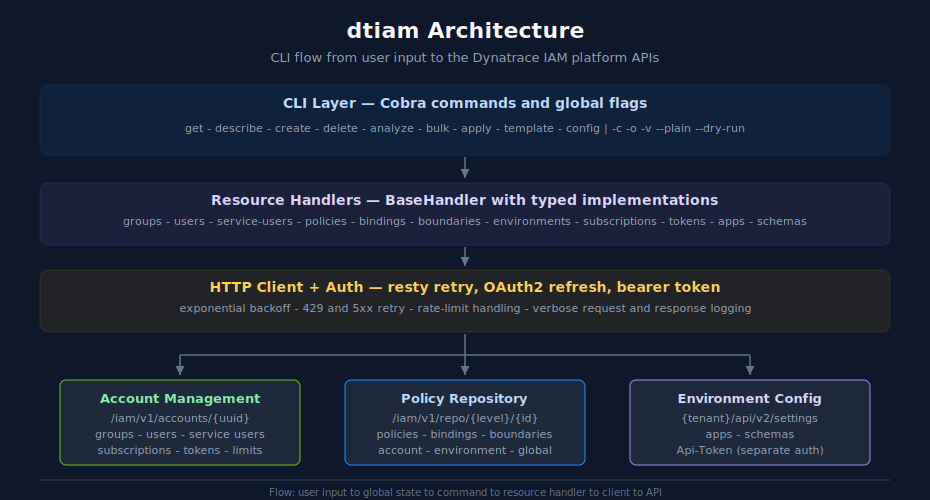

# Architecture

> **DISCLAIMER:** This tool is provided "as-is" without warranty. Use at your own risk. This is an independent, community-developed tool and is **NOT produced, endorsed, or supported by Dynatrace**.

Technical design and implementation details for dtiam.

## Overview

dtiam is a kubectl-inspired CLI for managing Dynatrace Identity and Access Management resources. It's written in Go using the Cobra CLI framework and follows idiomatic Go patterns for configuration, HTTP clients, and output formatting.



<!-- MARKDOWN_TABLE_ALTERNATIVE
| Layer | Responsibility | Key packages |
|-------|----------------|--------------|
| CLI Layer | Cobra root, subcommands, global flags (`-c`, `-o`, `-v`, `--plain`, `--dry-run`) | `internal/cli`, `internal/commands/*` |
| Resource Handlers | Typed CRUD over `BaseHandler` for groups, users, policies, bindings, boundaries, etc. | `internal/resources` |
| HTTP Client + Auth | resty transport, retry (429/5xx), OAuth2 token refresh, bearer token | `internal/client`, `internal/auth` |
| Account Management API | `/iam/v1/accounts/{uuid}` — groups, users, service users, subscriptions, tokens | — |
| Policy Repository API | `/iam/v1/repo/{level}/{id}` — policies, bindings, boundaries (account/env/global) | — |
| Environment Config API | `{tenant}/api/v2/settings` — apps, schemas (uses Api-Token, separate auth) | — |
-->


## Technology Stack

| Component | Library | Purpose |
|-----------|---------|---------|
| CLI Framework | github.com/spf13/cobra | Command-line interface with subcommands |
| HTTP Client | github.com/go-resty/resty/v2 | HTTP requests with retry and hooks |
| Config | github.com/spf13/viper | Configuration management with env binding |
| XDG Paths | github.com/adrg/xdg | XDG base directory support |
| Logging | github.com/sirupsen/logrus | Structured logging |
| Table Output | github.com/olekukonko/tablewriter | ASCII table formatting |
| OAuth2 | net/http + net/url (stdlib) | Custom OAuth2 client credentials flow |
| YAML | gopkg.in/yaml.v3 | Configuration and output formatting |

## Project Structure

```
dtiam/
├── cmd/dtiam/
│   └── main.go                      # Entry point
├── internal/
│   ├── cli/
│   │   ├── root.go                  # Root Cobra command, global flags
│   │   └── state.go                 # Global state (context, output, verbose)
│   ├── commands/
│   │   ├── common/
│   │   │   └── client.go            # Shared client creation
│   │   ├── config/
│   │   │   └── config.go            # Config management commands
│   │   ├── get/
│   │   │   ├── get.go               # Get subcommands
│   │   │   └── helpers.go           # Helper functions
│   │   ├── describe/
│   │   │   ├── describe.go          # Describe subcommands
│   │   │   └── helpers.go           # Helper functions
│   │   ├── create/
│   │   │   └── create.go            # Create subcommands
│   │   ├── delete/
│   │   │   └── delete.go            # Delete subcommands
│   │   ├── user/
│   │   │   └── user.go              # User management commands
│   │   ├── serviceuser/
│   │   │   └── serviceuser.go       # Service user commands
│   │   ├── group/
│   │   │   └── group.go             # Advanced group operations
│   │   ├── boundary/
│   │   │   └── boundary.go          # Boundary attach/detach
│   │   ├── account/
│   │   │   └── account.go           # Account limits/subscriptions
│   │   ├── cache/
│   │   │   └── cache.go             # Cache management
│   │   ├── bulk/
│   │   │   └── bulk.go              # Bulk operations from files
│   │   ├── export/
│   │   │   └── export.go            # Export resources for backup
│   │   └── analyze/
│   │       └── analyze.go           # Permission analysis commands
│   ├── config/
│   │   ├── config.go                # Config, Context, Credential structs
│   │   └── loader.go                # Load/save YAML, XDG paths
│   ├── client/
│   │   ├── client.go                # HTTP client with retry logic
│   │   ├── errors.go                # APIError type
│   │   └── urls.go                  # Centralized API URL constants
│   ├── auth/
│   │   ├── auth.go                  # TokenProvider interface
│   │   ├── oauth.go                 # OAuthTokenManager
│   │   └── bearer.go                # StaticTokenManager
│   ├── resources/
│   │   ├── handler.go               # BaseHandler, interfaces
│   │   ├── types.go                 # Typed response structs with table tags
│   │   ├── groups.go                # GroupHandler
│   │   ├── users.go                 # UserHandler
│   │   ├── policies.go              # PolicyHandler
│   │   ├── bindings.go              # BindingHandler
│   │   ├── boundaries.go            # BoundaryHandler
│   │   ├── environments.go          # EnvironmentHandler
│   │   ├── serviceusers.go          # ServiceUserHandler
│   │   ├── limits.go                # LimitsHandler
│   │   ├── subscriptions.go         # SubscriptionHandler
│   │   ├── tokens.go                # TokenHandler (platform tokens)
│   │   ├── apps.go                  # AppHandler (App Engine Registry)
│   │   └── schemas.go               # SchemaHandler (Settings API)
│   ├── prompt/
│   │   └── confirm.go               # Confirmation prompts (Confirm, ConfirmDelete)
│   ├── diagnostic/
│   │   └── error.go                 # Enhanced errors with exit codes and suggestions
│   ├── logging/
│   │   └── logger.go                # Structured logging with logrus
│   ├── suggest/
│   │   └── suggest.go               # Levenshtein command/flag suggestions
│   ├── utils/
│   │   ├── permissions.go           # Permissions calculator, matrix, effective API
│   │   └── safemap.go               # Safe type assertion helpers
│   └── output/
│       ├── format.go                # Format enum (table/json/yaml/csv)
│       ├── columns.go               # Column definitions per resource
│       ├── structprinter.go         # Struct-tag based printer
│       ├── table.go                 # TableFormatter
│       └── printer.go               # Unified Printer
├── pkg/
│   └── version/
│       └── version.go               # Version info (set via ldflags)
├── go.mod
├── Makefile
└── .goreleaser.yaml
```

## Core Components

### CLI Entry Point (`cmd/dtiam/main.go`)

The main entry point initializes the root command and registers all subcommands:

```go
func main() {
    rootCmd := cli.NewRootCmd()

    // Register command groups
    rootCmd.AddCommand(configcmd.Cmd)
    rootCmd.AddCommand(getcmd.Cmd)
    rootCmd.AddCommand(describecmd.Cmd)
    rootCmd.AddCommand(createcmd.Cmd)
    rootCmd.AddCommand(deletecmd.Cmd)
    rootCmd.AddCommand(usercmd.Cmd)
    rootCmd.AddCommand(serviceusercmd.Cmd)
    rootCmd.AddCommand(groupcmd.Cmd)
    rootCmd.AddCommand(boundarycmd.Cmd)
    rootCmd.AddCommand(accountcmd.Cmd)
    rootCmd.AddCommand(cachecmd.Cmd)
    rootCmd.AddCommand(bulkcmd.Cmd)
    rootCmd.AddCommand(exportcmd.Cmd)
    rootCmd.AddCommand(analyzecmd.Cmd)

    if err := rootCmd.Execute(); err != nil {
        os.Exit(1)
    }
}
```

### Global State (`internal/cli/state.go`)

Global state is managed through a singleton that commands access:

```go
type State struct {
    context  string
    output   output.Format
    verbose  bool
    plain    bool
    dryRun   bool
}

var GlobalState = &State{}

func (s *State) SetContext(ctx string)     { s.context = ctx }
func (s *State) GetContext() string        { return s.context }
func (s *State) SetOutput(f output.Format) { s.output = f }
func (s *State) GetOutput() output.Format  { return s.output }
func (s *State) IsDryRun() bool            { return s.dryRun }
func (s *State) IsVerbose() bool           { return s.verbose }
func (s *State) NewPrinter() *output.Printer {
    return output.NewPrinter(s.output, s.plain)
}
```

### Configuration System (`internal/config/`)

Configuration follows the kubectl config pattern:

```go
type Config struct {
    APIVersion     string            `yaml:"api-version"`
    Kind           string            `yaml:"kind"`
    CurrentContext string            `yaml:"current-context"`
    Contexts       []NamedContext    `yaml:"contexts"`
    Credentials    []NamedCredential `yaml:"credentials"`
    Preferences    Preferences       `yaml:"preferences,omitempty"`
}

type Context struct {
    AccountUUID    string `yaml:"account-uuid"`
    CredentialsRef string `yaml:"credentials-ref"`
}

type Credential struct {
    ClientID     string `yaml:"client-id"`
    ClientSecret string `yaml:"client-secret"`
}
```

**Storage Location:** `~/.config/dtiam/config` (XDG Base Directory compliant)

**Environment Variable Overrides:**
| Variable | Description |
|----------|-------------|
| `DTIAM_CONTEXT` | Override current context |
| `DTIAM_OUTPUT` | Default output format |
| `DTIAM_VERBOSE` | Enable verbose mode |
| `DTIAM_CLIENT_ID` | OAuth2 client ID |
| `DTIAM_CLIENT_SECRET` | OAuth2 client secret |
| `DTIAM_ACCOUNT_UUID` | Account UUID |
| `DTIAM_BEARER_TOKEN` | Static bearer token |

### HTTP Client (`internal/client/`)

The client provides:
- OAuth2 authentication with automatic token refresh
- Retry with exponential backoff for transient errors
- Rate limit handling (429 responses with Retry-After)
- Verbose logging for debugging

```go
type Client struct {
    httpClient   *http.Client
    baseURL      string
    accountUUID  string
    tokenManager TokenProvider
    retryConfig  RetryConfig
    verbose      bool
}

type RetryConfig struct {
    MaxRetries      int
    InitialDelay    time.Duration
    MaxDelay        time.Duration
    ExponentialBase float64
    RetryStatuses   []int
}

func (c *Client) Do(method, path string, body interface{}) (*http.Response, error) {
    for attempt := 0; attempt <= c.retryConfig.MaxRetries; attempt++ {
        req, _ := c.newRequest(method, path, body)
        resp, err := c.httpClient.Do(req)

        if err == nil && !c.shouldRetry(resp.StatusCode) {
            return resp, nil
        }

        delay := c.getRetryDelay(attempt, resp)
        time.Sleep(delay)
    }
    return nil, errors.New("max retries exceeded")
}
```

**Retry Configuration:**
- Default retries: 3
- Retry status codes: 429, 500, 502, 503, 504
- Initial delay: 1.0 seconds
- Max delay: 30.0 seconds
- Exponential base: 2.0

### Resource Handlers (`internal/resources/`)

Resource handlers follow a consistent pattern with interfaces:

```go
type Handler interface {
    ResourceName() string
}

type Lister interface {
    Handler
    List(ctx context.Context, params map[string]string) ([]map[string]any, error)
}

type Getter interface {
    Handler
    Get(ctx context.Context, id string) (map[string]any, error)
    GetByName(ctx context.Context, name string) (map[string]any, error)
}

type Creator interface {
    Handler
    Create(ctx context.Context, data map[string]any) (map[string]any, error)
}

type Deleter interface {
    Handler
    Delete(ctx context.Context, id string) error
}

type BaseHandler struct {
    client   *client.Client
    name     string
    basePath string
    listKey  string
}
```

Each resource handler implements additional operations specific to that resource type.

### Output Formatting (`internal/output/`)

The output system uses a strategy pattern:

```go
type Format int

const (
    FormatTable Format = iota
    FormatWide
    FormatJSON
    FormatYAML
    FormatCSV
    FormatPlain
)

type Column struct {
    Key      string
    Header   string
    WideOnly bool
}

type Printer struct {
    format Format
    plain  bool
}

func (p *Printer) Print(data []map[string]any, columns []Column) error {
    switch p.format {
    case FormatJSON:
        return p.printJSON(data)
    case FormatYAML:
        return p.printYAML(data)
    case FormatCSV:
        return p.printCSV(data, columns)
    case FormatTable, FormatWide:
        return p.printTable(data, columns, p.format == FormatWide)
    default:
        return p.printJSON(data)
    }
}
```

Column definitions support:
- Custom headers
- Wide-only columns (hidden in default table view)
- Nested key access with dot notation

## Data Flow

### Command Execution Flow

```
User Input
    ↓
Cobra CLI (cli/root.go)
    ↓
Global State Population (cli/state.go)
    ↓
Command Handler (commands/*.go)
    ↓
Configuration Loading (config/loader.go)
    ↓
Client Creation (client/client.go)
    ↓
OAuth2 Token Acquisition (auth/oauth.go)
    ↓
Resource Handler (resources/*.go)
    ↓
API Request with Retry
    ↓
Response Processing
    ↓
Output Formatting (output/printer.go)
    ↓
User Output
```

### Authentication Flow

```
TokenProvider.GetToken()
    ↓
Check Token Cache
    ↓ (expired or missing)
OAuth2 Token Request
    POST https://sso.dynatrace.com/sso/oauth2/token
    ↓
Token Cached (with expiry buffer)
    ↓
Authorization Header Returned
```

## API Endpoints

Base URL: `https://api.dynatrace.com/iam/v1/accounts/{account_uuid}`

| Resource | Endpoint |
|----------|----------|
| Groups | `/groups` |
| Users | `/users` |
| Service Users | `/service-users` |
| Limits | `/limits` |
| Environments | `/environments` |
| Policies | `/repo/{levelType}/{levelId}/policies` |
| Bindings | `/repo/{levelType}/{levelId}/bindings` |
| Boundaries | `/repo/{levelType}/{levelId}/boundaries` |

Policy levels:
- `account/{account_uuid}` - Account-level policies
- `environment/{env_id}` - Environment-specific policies
- `global/global` - Global (Dynatrace-managed) policies

## Error Handling

Errors are categorized and handled consistently:

```go
type APIError struct {
    Message      string
    StatusCode   int
    ResponseBody string
}

func (e *APIError) Error() string {
    return fmt.Sprintf("%s (status %d)", e.Message, e.StatusCode)
}

func (e *APIError) IsNotFound() bool {
    return e.StatusCode == 404
}

func (e *APIError) IsForbidden() bool {
    return e.StatusCode == 403
}

func (e *APIError) IsConflict() bool {
    return e.StatusCode == 409
}
```

## Building

The project uses a Makefile for common operations:

```makefile
# Build for current platform
build:
    go build -ldflags "$(LDFLAGS)" -o bin/dtiam ./cmd/dtiam

# Build for all platforms
build-all:
    GOOS=linux GOARCH=amd64 go build ...
    GOOS=darwin GOARCH=amd64 go build ...
    GOOS=darwin GOARCH=arm64 go build ...
    GOOS=windows GOARCH=amd64 go build ...

# Run tests
test:
    go test -v ./...

# Run linter
lint:
    golangci-lint run

# Install locally
install:
    go install ./cmd/dtiam
```

## Extensibility

### Adding a New Resource

1. Create handler in `internal/resources/`:
```go
type NewResourceHandler struct {
    *BaseHandler
}

func NewNewResourceHandler(c *client.Client) *NewResourceHandler {
    return &NewResourceHandler{
        BaseHandler: &BaseHandler{
            client:   c,
            name:     "new-resource",
            basePath: "/new-resources",
            listKey:  "items",
        },
    }
}

func (h *NewResourceHandler) List(ctx context.Context, params map[string]string) ([]map[string]any, error) {
    return h.BaseHandler.List(ctx, params)
}
```

2. Add column definitions in `internal/output/columns.go`:
```go
func NewResourceColumns() []Column {
    return []Column{
        {Key: "uuid", Header: "UUID"},
        {Key: "name", Header: "NAME"},
    }
}
```

3. Create commands in `internal/commands/`:
```go
var getNewResourceCmd = &cobra.Command{
    Use:   "new-resources",
    Short: "List new resources",
    RunE: func(cmd *cobra.Command, args []string) error {
        c, _ := common.CreateClient()
        defer c.Close()

        handler := resources.NewNewResourceHandler(c)
        results, _ := handler.List(context.Background(), nil)

        printer := cli.GlobalState.NewPrinter()
        return printer.Print(results, output.NewResourceColumns())
    },
}
```

4. Register in `cmd/dtiam/main.go`:
```go
getcmd.Cmd.AddCommand(getNewResourceCmd)
```

### Adding a New Output Format

1. Add to Format enum in `internal/output/format.go`:
```go
const (
    FormatXML Format = iota + 10
)
```

2. Implement formatting in `internal/output/printer.go`:
```go
func (p *Printer) printXML(data []map[string]any) error {
    // Convert data to XML
    ...
}
```

3. Add case to Print switch statement:
```go
case FormatXML:
    return p.printXML(data)
```

## Testing

Run tests with:
```bash
go test -v ./...
go test -cover ./...
```

## See Also

- [Command Reference](COMMANDS.md)
- [Quick Start Guide](QUICK_START.md)
- [API Reference](API_REFERENCE.md)
- [Policies with Boundaries](POLICIES_WITH_BOUNDARIES.md)
