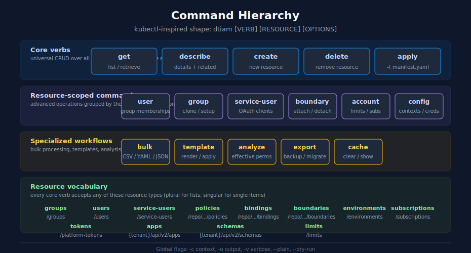

# Command Reference

> **DISCLAIMER:** This tool is provided "as-is" without warranty. Use at your own risk. This is an independent, community-developed tool and is **NOT produced, endorsed, or supported by Dynatrace**.

Complete reference for all dtiam commands and their options.



<!-- MARKDOWN_TABLE_ALTERNATIVE
| Tier | Verbs | Notes |
|------|-------|-------|
| Core verbs | `get`, `describe`, `create`, `delete`, `apply` | Universal CRUD plus declarative apply |
| Resource-scoped | `user`, `group`, `service-user`, `boundary`, `account`, `config` | Advanced operations grouped by the resource they act on |
| Specialized workflows | `bulk`, `template`, `analyze`, `export`, `cache` | Bulk processing, templates, analysis, backup, caching |
| Resource vocabulary | `groups`, `users`, `service-users`, `policies`, `bindings`, `boundaries`, `environments`, `subscriptions`, `tokens`, `apps`, `schemas`, `limits` | Plural for lists, singular for single items |

Global flags: `-c context`, `-o output`, `-v verbose`, `--plain`, `--dry-run`.
-->

## Table of Contents

- [Global Options](#global-options)
- [Environment Variables](#environment-variables)
- [config](#config) - Configuration management
- [get](#get) - List/retrieve resources
- [describe](#describe) - Detailed resource information
- [create](#create) - Create resources
- [delete](#delete) - Delete resources
- [user](#user) - User management
- [service-user](#service-user) - Service user (OAuth client) management
- [group](#group) - Advanced group operations
- [boundary](#boundary) - Boundary management
- [account](#account) - Account limits and subscriptions
- [cache](#cache) - Cache management
- [bulk](#bulk) - Bulk operations from files
- [export](#export) - Export resources for backup/migration
- [analyze](#analyze) - Permission analysis and compliance

---

## Global Options

These options apply to all commands:

```bash
dtiam [OPTIONS] COMMAND [ARGS]
```

| Option            | Short | Description                                 |
| ----------------- | ----- | ------------------------------------------- |
| `--context TEXT`  | `-c`  | Override the current context                |
| `--output FORMAT` | `-o`  | Output format: table, json, yaml, csv, wide |
| `--verbose`       | `-v`  | Enable verbose/debug output                 |
| `--plain`         |       | Plain output mode (no colors, no prompts)   |
| `--dry-run`       |       | Preview changes without applying them       |
| `--version`       | `-V`  | Show version and exit                       |
| `--help`          |       | Show help message                           |

---

## Environment Variables

dtiam supports authentication and configuration via environment variables:

### Authentication Variables

| Variable              | Description            | Use Case                 |
| --------------------- | ---------------------- | ------------------------ |
| `DTIAM_BEARER_TOKEN`  | Static bearer token    | Quick testing, debugging |
| `DTIAM_CLIENT_ID`     | OAuth2 client ID       | Automation (recommended) |
| `DTIAM_CLIENT_SECRET` | OAuth2 client secret   | Automation (recommended) |
| `DTIAM_ACCOUNT_UUID`  | Dynatrace account UUID | Required for all methods |

### Configuration Variables

| Variable        | Description                   |
| --------------- | ----------------------------- |
| `DTIAM_CONTEXT` | Override current context name |
| `DTIAM_OUTPUT`  | Default output format         |
| `DTIAM_VERBOSE` | Enable verbose mode           |

### Authentication Priority

When multiple authentication methods are configured:

1. **Bearer Token** - `DTIAM_BEARER_TOKEN` + `DTIAM_ACCOUNT_UUID`
2. **OAuth2 (env)** - `DTIAM_CLIENT_ID` + `DTIAM_CLIENT_SECRET` + `DTIAM_ACCOUNT_UUID`
3. **Config file** - Context with OAuth2 credentials

### OAuth2 vs Bearer Token

| Feature          | OAuth2 (Recommended) | Bearer Token       |
| ---------------- | -------------------- | ------------------ |
| Auto-refresh     | ✅ Yes               | ❌ No              |
| Long-running     | ✅ Suitable          | ❌ Not recommended |
| Automation       | ✅ Recommended       | ❌ Not recommended |
| Quick testing    | ✅ Works             | ✅ Ideal           |
| Setup complexity | Medium               | Low                |

**Example: OAuth2 Authentication**

```bash
export DTIAM_CLIENT_ID="dt0s01.XXXXX"
export DTIAM_CLIENT_SECRET="dt0s01.XXXXX.YYYYY"
export DTIAM_ACCOUNT_UUID="abc-123-def"
dtiam get groups
```

**Example: Bearer Token Authentication**

```bash
# WARNING: Token will NOT auto-refresh!
export DTIAM_BEARER_TOKEN="dt0c01.XXXXX.YYYYY..."
export DTIAM_ACCOUNT_UUID="abc-123-def"
dtiam get groups
```

---

## config

Manage configuration contexts and credentials.

### config view

Display the current configuration.

```bash
dtiam config view
```

### config get-contexts

List all configured contexts.

```bash
dtiam config get-contexts
```

### config use-context

Switch to a different context.

```bash
dtiam config use-context NAME
```

| Argument | Description               |
| -------- | ------------------------- |
| `NAME`   | Context name to switch to |

### config set-context

Create or update a context.

```bash
dtiam config set-context NAME [OPTIONS]
```

| Argument/Option     | Short | Description                     |
| ------------------- | ----- | ------------------------------- |
| `NAME`              |       | Context name                    |
| `--account-uuid`    | `-a`  | Dynatrace account UUID          |
| `--credentials-ref` | `-c`  | Reference to a named credential |

**Example:**

```bash
dtiam config set-context prod --account-uuid abc-123 --credentials-ref prod-creds
```

### config delete-context

Delete a context.

```bash
dtiam config delete-context NAME
```

### config set-credentials

Store OAuth2 credentials.

```bash
dtiam config set-credentials NAME [OPTIONS]
```

| Argument/Option   | Short | Description          |
| ----------------- | ----- | -------------------- |
| `NAME`            |       | Credential name      |
| `--client-id`     | `-i`  | OAuth2 client ID     |
| `--client-secret` | `-s`  | OAuth2 client secret |

**Example:**

```bash
dtiam config set-credentials prod-creds --client-id dt0s01.XXX --client-secret dt0s01.XXX.YYY
```

### config delete-credentials

Delete stored credentials.

```bash
dtiam config delete-credentials NAME
```

### config get-credentials

List all stored credentials.

```bash
dtiam config get-credentials
```

---

## get

List or retrieve IAM resources.

### get groups

List or get IAM groups.

```bash
dtiam get groups [IDENTIFIER] [OPTIONS]
```

| Argument/Option | Short | Description                   |
| --------------- | ----- | ----------------------------- |
| `IDENTIFIER`    |       | Group UUID or name (optional) |
| `--output`      | `-o`  | Output format                 |

### get users

List or get IAM users.

```bash
dtiam get users [IDENTIFIER] [OPTIONS]
```

| Argument/Option | Short | Description                  |
| --------------- | ----- | ---------------------------- |
| `IDENTIFIER`    |       | User UID or email (optional) |
| `--output`      | `-o`  | Output format                |

### get policies

List or get IAM policies.

```bash
dtiam get policies [IDENTIFIER] [OPTIONS]
```

| Argument/Option | Short | Description                             |
| --------------- | ----- | --------------------------------------- |
| `IDENTIFIER`    |       | Policy UUID or name (optional)          |
| `--level`       | `-l`  | Policy level: account (default), global |
| `--output`      | `-o`  | Output format                           |

### get bindings

List IAM policy bindings.

```bash
dtiam get bindings [OPTIONS]
```

| Option     | Short | Description          |
| ---------- | ----- | -------------------- |
| `--group`  | `-g`  | Filter by group UUID |
| `--output` | `-o`  | Output format        |

### get environments

List or get Dynatrace environments.

```bash
dtiam get environments [IDENTIFIER] [OPTIONS]
```

| Argument/Option | Short | Description                       |
| --------------- | ----- | --------------------------------- |
| `IDENTIFIER`    |       | Environment ID or name (optional) |
| `--output`      | `-o`  | Output format                     |

### get boundaries

List or get IAM policy boundaries.

```bash
dtiam get boundaries [IDENTIFIER] [OPTIONS]
```

| Argument/Option | Short | Description                      |
| --------------- | ----- | -------------------------------- |
| `IDENTIFIER`    |       | Boundary UUID or name (optional) |
| `--output`      | `-o`  | Output format                    |

### get tokens

List or get platform tokens.

```bash
dtiam get tokens [IDENTIFIER] [OPTIONS]
```

| Argument/Option | Short | Description                    |
| --------------- | ----- | ------------------------------ |
| `IDENTIFIER`    |       | Token ID (optional)            |
| `--output`      | `-o`  | Output format                  |

### get apps

List apps from the App Engine Registry. Requires `--environment`.

```bash
dtiam get apps [IDENTIFIER] --environment ENV [OPTIONS]
```

| Argument/Option | Short | Description                              |
| --------------- | ----- | ---------------------------------------- |
| `IDENTIFIER`    |       | App ID (optional)                        |
| `--environment` |       | Environment ID or URL (required)         |
| `--output`      | `-o`  | Output format                            |

### get schemas

List Settings 2.0 schemas from the Environment API. Requires `--environment`.

```bash
dtiam get schemas [IDENTIFIER] --environment ENV [OPTIONS]
```

| Argument/Option | Short | Description                              |
| --------------- | ----- | ---------------------------------------- |
| `IDENTIFIER`    |       | Schema ID (optional)                     |
| `--environment` |       | Environment ID or URL (required)         |
| `--name`        |       | Filter schemas by name pattern           |
| `--output`      | `-o`  | Output format                            |

---

## describe

Show detailed resource information.

### describe group

Show detailed information about an IAM group.

```bash
dtiam describe group IDENTIFIER [--output FORMAT]
```

Displays: UUID, name, description, member count, members list, policy bindings.

### describe user

Show detailed information about an IAM user.

```bash
dtiam describe user IDENTIFIER [--output FORMAT]
```

Displays: UID, email, status, creation date, group memberships.

### describe policy

Show detailed information about an IAM policy.

```bash
dtiam describe policy IDENTIFIER [OPTIONS]
```

| Option     | Short | Description                             |
| ---------- | ----- | --------------------------------------- |
| `--level`  | `-l`  | Policy level: account (default), global |
| `--output` | `-o`  | Output format                           |

Displays: UUID, name, description, statement query, parsed permissions.

### describe environment

Show detailed information about a Dynatrace environment.

```bash
dtiam describe environment IDENTIFIER [--output FORMAT]
```

### describe boundary

Show detailed information about an IAM policy boundary.

```bash
dtiam describe boundary IDENTIFIER [--output FORMAT]
```

Displays: UUID, name, description, boundary query, attached policies count.

---

## create

Create IAM resources.

### create group

Create a new IAM group.

```bash
dtiam create group [OPTIONS]
```

| Option          | Short | Description           |
| --------------- | ----- | --------------------- |
| `--name`        | `-n`  | Group name (required) |
| `--description` | `-d`  | Group description     |
| `--output`      | `-o`  | Output format         |

**Example:**

```bash
dtiam create group --name "DevOps Team" --description "Platform engineering"
```

### create policy

Create a new IAM policy.

```bash
dtiam create policy [OPTIONS]
```

| Option          | Short | Description                       |
| --------------- | ----- | --------------------------------- |
| `--name`        | `-n`  | Policy name (required)            |
| `--statement`   | `-s`  | Policy statement query (required) |
| `--description` | `-d`  | Policy description                |
| `--output`      | `-o`  | Output format                     |

**Example:**

```bash
dtiam create policy --name "viewer" --statement "ALLOW settings:objects:read;"
```

### create binding

Create a policy binding (bind a policy to a group).

```bash
dtiam create binding [OPTIONS]
```

| Option       | Short | Description                                    |
| ------------ | ----- | ---------------------------------------------- |
| `--group`    | `-g`  | Group UUID or name (required)                  |
| `--policy`   | `-p`  | Policy UUID or name (required)                 |
| `--boundary` | `-b`  | Boundary UUID or name (optional)               |
| `--param`    |       | Bind parameter as key=value (repeatable)       |
| `--output`   | `-o`  | Output format                                  |

**Examples:**

```bash
dtiam create binding --group "DevOps Team" --policy "admin-policy"
dtiam create binding --group "DevOps Team" --policy "env-policy" --param env=production --param region=us-east
```

### create boundary

Create a new IAM policy boundary.

```bash
dtiam create boundary [OPTIONS]
```

| Option          | Short | Description                        |
| --------------- | ----- | ---------------------------------- |
| `--name`        | `-n`  | Boundary name (required)           |
| `--zones`       | `-z`  | Management zones (comma-separated) |
| `--query`       | `-q`  | Custom boundary query              |
| `--description` | `-d`  | Boundary description               |
| `--output`      | `-o`  | Output format                      |

Either `--zones` or `--query` must be provided.

**Example:**

```bash
dtiam create boundary --name "prod-only" --zones "Production,Staging"
```

### create token

Create a new platform token. The token value is only returned once during creation.

```bash
dtiam create token [OPTIONS]
```

| Option         | Short | Description                              |
| -------------- | ----- | ---------------------------------------- |
| `--name`       | `-n`  | Token name (required)                    |
| `--scopes`     |       | Comma-separated scopes                   |
| `--expires-in` |       | Token expiration (e.g., 30d, 1y)         |
| `--output`     | `-o`  | Output format                            |

**Example:**

```bash
dtiam create token --name "CI Token" --scopes "account-idm-read" --expires-in 30d
```

---

## delete

Delete IAM resources.

### delete group

Delete an IAM group.

```bash
dtiam delete group IDENTIFIER [--force]
```

| Option    | Short | Description       |
| --------- | ----- | ----------------- |
| `--force` | `-f`  | Skip confirmation |

### delete policy

Delete an IAM policy.

```bash
dtiam delete policy IDENTIFIER [OPTIONS]
```

| Option    | Short | Description       |
| --------- | ----- | ----------------- |
| `--force` | `-f`  | Skip confirmation |

### delete binding

Delete a policy binding.

```bash
dtiam delete binding [OPTIONS]
```

| Option     | Short | Description            |
| ---------- | ----- | ---------------------- |
| `--group`  | `-g`  | Group UUID (required)  |
| `--policy` | `-p`  | Policy UUID (required) |
| `--force`  | `-f`  | Skip confirmation      |

### delete boundary

Delete an IAM policy boundary.

```bash
dtiam delete boundary IDENTIFIER [--force]
```

### delete user

Delete an IAM user.

```bash
dtiam delete user IDENTIFIER [--force]
```

### delete service-user

Delete a service user.

```bash
dtiam delete service-user IDENTIFIER [--force]
```

### delete token

Delete a platform token.

```bash
dtiam delete token IDENTIFIER [--force]
```

---

## user

User management operations.

### user create

Create a new user in the account.

```bash
dtiam user create EMAIL [OPTIONS]
```

| Argument/Option | Short | Description                          |
| --------------- | ----- | ------------------------------------ |
| `EMAIL`         |       | User email address (required)        |
| `--first-name`  |       | User's first name                    |
| `--last-name`   |       | User's last name                     |
| `--groups`      | `-g`  | Comma-separated group UUIDs or names |
| `--output`      | `-o`  | Output format                        |

**Examples:**

```bash
dtiam user create user@example.com
dtiam user create user@example.com --first-name John --last-name Doe
dtiam user create user@example.com --groups "DevOps,Platform"
```

### user info

Show detailed information about a user. Equivalent to `describe user`.

```bash
dtiam user info IDENTIFIER
```

| Argument      | Description                      |
| ------------- | -------------------------------- |
| `IDENTIFIER`  | User UID or email address        |

**Examples:**

```bash
dtiam user info alice@example.com
dtiam user info alice@example.com -o json
```

### user add-to-groups

Add a user to multiple groups.

```bash
dtiam user add-to-groups EMAIL [OPTIONS]
```

| Argument/Option | Short | Description                                     |
| --------------- | ----- | ----------------------------------------------- |
| `EMAIL`         |       | User email address                              |
| `--groups`      | `-g`  | Comma-separated group UUIDs or names (required) |

**Example:**

```bash
dtiam user add-to-groups user@example.com --groups "DevOps,Platform"
```

### user remove-from-groups

Remove a user from multiple groups.

```bash
dtiam user remove-from-groups EMAIL [OPTIONS]
```

| Argument/Option | Short | Description                                     |
| --------------- | ----- | ----------------------------------------------- |
| `EMAIL`         |       | User email address                              |
| `--groups`      | `-g`  | Comma-separated group UUIDs or names (required) |

### user replace-groups

Replace all group memberships for a user.

```bash
dtiam user replace-groups EMAIL [OPTIONS]
```

| Argument/Option | Short | Description                          |
| --------------- | ----- | ------------------------------------ |
| `EMAIL`         |       | User email address                   |
| `--groups`      | `-g`  | Comma-separated group UUIDs or names |

**Example:**

```bash
dtiam user replace-groups user@example.com --groups "DevOps,Platform"
```

### user list-groups

List all groups a user belongs to.

```bash
dtiam user list-groups IDENTIFIER [--output FORMAT]
```

---

## service-user

Service user (OAuth client) management.

Service users are used for programmatic API access. When you create a service user, you receive OAuth client credentials that can be used to authenticate API requests.

### service-user list

List all service users in the account.

```bash
dtiam service-user list [--output FORMAT]
```

### service-user get

Get details of a service user.

```bash
dtiam service-user get USER [--output FORMAT]
```

| Argument | Description               |
| -------- | ------------------------- |
| `USER`   | Service user UUID or name |

### service-user create

Create a new service user (OAuth client).

**IMPORTANT:** Save the client secret immediately - it cannot be retrieved later!

```bash
dtiam service-user create [OPTIONS]
```

| Option          | Short | Description                          |
| --------------- | ----- | ------------------------------------ |
| `--name`        | `-n`  | Service user name (required)         |
| `--description` | `-d`  | Description                          |
| `--groups`      | `-g`  | Comma-separated group UUIDs or names |
| `--output`      | `-o`  | Output format                        |

**Examples:**

```bash
dtiam service-user create --name "CI Pipeline"
dtiam service-user create --name "CI Pipeline" --groups "DevOps,Automation"
```

### service-user update

Update a service user.

```bash
dtiam service-user update USER [OPTIONS]
```

| Argument/Option | Short | Description               |
| --------------- | ----- | ------------------------- |
| `USER`          |       | Service user UUID or name |
| `--name`        | `-n`  | New name                  |
| `--description` | `-d`  | New description           |
| `--output`      | `-o`  | Output format             |

### service-user delete

Delete a service user.

```bash
dtiam service-user delete USER [--force]
```

**Warning:** Deleting a service user will invalidate any OAuth tokens issued to it.

### service-user add-to-group

Add a service user to a group.

```bash
dtiam service-user add-to-group USER [OPTIONS]
```

| Argument/Option | Short | Description                   |
| --------------- | ----- | ----------------------------- |
| `USER`          |       | Service user UUID or name     |
| `--group`       | `-g`  | Group UUID or name (required) |

### service-user remove-from-group

Remove a service user from a group.

```bash
dtiam service-user remove-from-group USER [OPTIONS]
```

| Argument/Option | Short | Description                   |
| --------------- | ----- | ----------------------------- |
| `USER`          |       | Service user UUID or name     |
| `--group`       | `-g`  | Group UUID or name (required) |

### service-user list-groups

List all groups a service user belongs to.

```bash
dtiam service-user list-groups USER [--output FORMAT]
```

---

## group

Advanced group operations.

### group members

List all members of a group.

```bash
dtiam group members IDENTIFIER [--output FORMAT]
```

### group add-member

Add a user to a group.

```bash
dtiam group add-member IDENTIFIER [OPTIONS]
```

| Argument/Option | Short | Description                        |
| --------------- | ----- | ---------------------------------- |
| `IDENTIFIER`    |       | Group UUID or name                 |
| `--email`       | `-e`  | User email address to add (required) |

### group remove-member

Remove a user from a group.

```bash
dtiam group remove-member IDENTIFIER [OPTIONS]
```

| Argument/Option | Short | Description                  |
| --------------- | ----- | ---------------------------- |
| `IDENTIFIER`    |       | Group UUID or name           |
| `--user`        | `-u`  | User UID to remove (required) |

### group bindings

List all policy bindings for a group.

```bash
dtiam group bindings IDENTIFIER [--output FORMAT]
```

### group clone

Clone an existing group with optional members and policy bindings.

```bash
dtiam group clone SOURCE --name NEW_NAME [OPTIONS]
```

| Option               | Short | Description                                |
| -------------------- | ----- | ------------------------------------------ |
| `--name`             | `-n`  | Name for the new group (required)          |
| `--description`      | `-d`  | Description for the new group              |
| `--include-members`  |       | Copy group members to the new group        |
| `--include-policies` |       | Copy policy bindings to the new group      |

**Examples:**

```bash
dtiam group clone "Production Team" --name "Staging Team"
dtiam group clone "Production Team" --name "Staging Team" --include-members --include-policies
dtiam group clone "Production Team" --name "Staging Team" --dry-run
```

### group setup

One-step group provisioning from a YAML/JSON policies file.

```bash
dtiam group setup --name NAME --policies-file FILE [OPTIONS]
```

| Option             | Short | Description                                       |
| ------------------ | ----- | ------------------------------------------------- |
| `--name`           | `-n`  | Name for the new group (required)                 |
| `--description`    | `-d`  | Group description                                 |
| `--policies-file`  | `-f`  | YAML or JSON file with policy definitions (required) |

**Policies file format:**

```yaml
policies:
  - name: "ReadOnly Policy"
    boundaries:
      - "boundary-uuid-1"
  - name: "Admin Policy"
```

**Examples:**

```bash
dtiam group setup --name "New Team" --policies-file policies.yaml
dtiam group setup --name "New Team" --policies-file policies.yaml --dry-run
```

---

## boundary

Boundary attach/detach operations.

### boundary attach

Attach a boundary to an existing binding.

```bash
dtiam boundary attach [OPTIONS]
```

| Option       | Short | Description                      |
| ------------ | ----- | -------------------------------- |
| `--group`    | `-g`  | Group UUID or name (required)    |
| `--policy`   | `-p`  | Policy UUID or name (required)   |
| `--boundary` | `-b`  | Boundary UUID or name (required) |

**Example:**

```bash
dtiam boundary attach --group "DevOps" --policy "admin-policy" --boundary "prod-boundary"
```

### boundary detach

Detach a boundary from a binding.

```bash
dtiam boundary detach [OPTIONS]
```

| Option       | Short | Description                      |
| ------------ | ----- | -------------------------------- |
| `--group`    | `-g`  | Group UUID or name (required)    |
| `--policy`   | `-p`  | Policy UUID or name (required)   |
| `--boundary` | `-b`  | Boundary UUID or name (required) |

### boundary list-attached

List all bindings that use a boundary.

```bash
dtiam boundary list-attached BOUNDARY [--output FORMAT]
```

### boundary create-app-boundary

Create a boundary scoped to specific Dynatrace app IDs.

```bash
dtiam boundary create-app-boundary NAME --app-ids ID1,ID2 [OPTIONS]
```

| Option              | Description                                    |
| ------------------- | ---------------------------------------------- |
| `--app-ids`         | Comma-separated app IDs (required)             |
| `--not-in`          | Use NOT IN (exclude apps instead of allow)     |
| `--environment`     | Environment ID for app validation              |
| `--description`     | Boundary description                           |
| `--skip-validation` | Skip app ID validation                         |

**Examples:**

```bash
dtiam boundary create-app-boundary "Dashboard Apps" --app-ids dynatrace.dashboards,dynatrace.notebooks
dtiam boundary create-app-boundary "No Classic" --app-ids dynatrace.classic.smartscape --not-in
dtiam boundary create-app-boundary "My Apps" --app-ids dynatrace.dashboards --environment abc12345
```

### boundary create-schema-boundary

Create a boundary scoped to specific Settings 2.0 schema IDs.

```bash
dtiam boundary create-schema-boundary NAME --schema-ids ID1,ID2 [OPTIONS]
```

| Option              | Description                                    |
| ------------------- | ---------------------------------------------- |
| `--schema-ids`      | Comma-separated schema IDs (required)          |
| `--not-in`          | Use NOT IN (exclude schemas instead of allow)  |
| `--environment`     | Environment ID for schema validation           |
| `--description`     | Boundary description                           |
| `--skip-validation` | Skip schema ID validation                      |

**Examples:**

```bash
dtiam boundary create-schema-boundary "Alerting Only" --schema-ids builtin:alerting.profile,builtin:alerting.maintenance-window
dtiam boundary create-schema-boundary "No Spans" --schema-ids builtin:span-attribute --not-in
```

---

## account

Account limits and subscription information.

### account limits

List account limits and quotas.

```bash
dtiam account limits [OPTIONS]
```

| Option      | Description                         |
| ----------- | ----------------------------------- |
| `--summary` | Show summary with usage percentages |
| `--output`  | Output format                       |

Shows current usage and maximum allowed values for account resources like users, groups, and environments.

**Examples:**

```bash
dtiam account limits
dtiam account limits --summary
```

### account check-capacity

Check if there is capacity for additional resources.

```bash
dtiam account check-capacity LIMIT_NAME [OPTIONS]
```

| Argument/Option | Description                                          |
| --------------- | ---------------------------------------------------- |
| `LIMIT_NAME`    | Name of the limit to check (required)                |
| `--additional`  | Number of additional resources to check (default: 1) |

**Examples:**

```bash
dtiam account check-capacity user-limit
dtiam account check-capacity group-limit --additional 5
```

### account subscriptions

List account subscriptions.

```bash
dtiam account subscriptions [--output FORMAT]
```

Shows all subscriptions including type, status, and time period.

### account forecast

Get usage forecast for subscriptions.

```bash
dtiam account forecast [--output FORMAT]
```

### account capabilities

List capability flags from subscriptions.

```bash
dtiam account capabilities [SUBSCRIPTION] [--output FORMAT]
```

When called without arguments, lists capabilities from all subscriptions.
When given a subscription UUID or name, lists capabilities for that subscription only.

```bash
dtiam account capabilities
dtiam account capabilities "Enterprise Plan"
dtiam account capabilities -o json
```

---

## cache

Cache management.

### cache stats

Show cache statistics.

```bash
dtiam cache stats
```

### cache clear

Clear cache entries.

```bash
dtiam cache clear
```

---

## bulk

Bulk operations for managing multiple IAM resources from files.

### bulk add-users-to-group

Add multiple users to a group from a file.

```bash
dtiam bulk add-users-to-group [OPTIONS]
```

| Option              | Short | Description                                    |
| ------------------- | ----- | ---------------------------------------------- |
| `--file`            | `-f`  | File with user emails (JSON, YAML, or CSV)     |
| `--group`           | `-g`  | Group UUID or name                             |
| `--email-field`     | `-e`  | Field name containing email addresses (default: "email") |
| `--continue-on-error` |     | Continue processing on errors                  |

**File Format Examples:**

JSON/YAML:
```json
[{"email": "user1@example.com"}, {"email": "user2@example.com"}]
```

CSV:
```csv
email
user1@example.com
user2@example.com
```

**Examples:**

```bash
dtiam bulk add-users-to-group --file users.csv --group "DevOps Team"
dtiam bulk add-users-to-group -f users.json -g DevOps --continue-on-error
```

### bulk remove-users-from-group

Remove multiple users from a group from a file.

```bash
dtiam bulk remove-users-from-group [OPTIONS]
```

| Option              | Short | Description                                    |
| ------------------- | ----- | ---------------------------------------------- |
| `--file`            | `-f`  | File with user emails/UIDs (JSON, YAML, or CSV)|
| `--group`           | `-g`  | Group UUID or name                             |
| `--user-field`      | `-u`  | Field name containing email or UID (default: "email") |
| `--continue-on-error` |     | Continue processing on errors                  |
| `--force`           | `-F`  | Skip confirmation prompt                       |

**Example:**

```bash
dtiam bulk remove-users-from-group --file users.csv --group "DevOps Team" --force
```

### bulk create-groups

Create multiple groups from a file.

```bash
dtiam bulk create-groups [OPTIONS]
```

| Option              | Short | Description                          |
| ------------------- | ----- | ------------------------------------ |
| `--file`            | `-f`  | File with group definitions (YAML)   |
| `--continue-on-error` |     | Continue processing on errors        |

**File Format:**

```yaml
groups:
  - name: "Group A"
    description: "Description for Group A"
  - name: "Group B"
    description: "Description for Group B"
```

**Example:**

```bash
dtiam bulk create-groups --file groups.yaml
dtiam bulk create-groups -f groups.yaml --dry-run
```

### bulk create-bindings

Create multiple policy bindings from a file.

```bash
dtiam bulk create-bindings [OPTIONS]
```

| Option              | Short | Description                            |
| ------------------- | ----- | -------------------------------------- |
| `--file`            | `-f`  | File with binding definitions (YAML)   |
| `--continue-on-error` |     | Continue processing on errors          |

**File Format:**

```yaml
bindings:
  - group: "group-uuid-or-name"
    policy: "policy-uuid-or-name"
    boundary: "optional-boundary-uuid"
  - group: "another-group"
    policy: "another-policy"
```

**Example:**

```bash
dtiam bulk create-bindings --file bindings.yaml
dtiam bulk create-bindings -f bindings.yaml --dry-run
```

### bulk export-group-members

Export group members to a file.

```bash
dtiam bulk export-group-members [OPTIONS]
```

| Option     | Short | Description                          |
| ---------- | ----- | ------------------------------------ |
| `--group`  | `-g`  | Group UUID or name (required)        |
| `--output` | `-o`  | Output file path                     |
| `--format` | `-F`  | Output format: csv, json, yaml (default: csv) |

**Examples:**

```bash
dtiam bulk export-group-members --group "DevOps Team" --output members.csv
dtiam bulk export-group-members -g DevOps -o members.json -F json
```

### bulk create-groups-with-policies

Create groups and bind policies from a CSV, JSON, or YAML file.

```bash
dtiam bulk create-groups-with-policies --file FILE [OPTIONS]
```

| Option               | Short | Description                          |
| -------------------- | ----- | ------------------------------------ |
| `--file`             | `-f`  | Input file (required)                |
| `--continue-on-error`|       | Continue processing on errors        |

CSV columns: `group_name`, `description`, `policy_name`, `boundary_name`

**Examples:**

```bash
dtiam bulk create-groups-with-policies --file groups-policies.csv
dtiam bulk create-groups-with-policies --file groups-policies.yaml --continue-on-error
dtiam bulk create-groups-with-policies --file groups-policies.csv --dry-run
```

---

## export

Export IAM resources for backup or migration.

### export all

Export all IAM resources to files.

```bash
dtiam export all [OPTIONS]
```

| Option           | Short | Description                                    |
| ---------------- | ----- | ---------------------------------------------- |
| `--output`       | `-o`  | Output directory (default: ".")                |
| `--format`       | `-f`  | Output format: csv, json, yaml (default: csv)  |
| `--prefix`       | `-p`  | File name prefix (default: "dtiam")            |
| `--include`      | `-i`  | Comma-separated list of exports to include     |
| `--detailed`     | `-d`  | Include detailed/enriched data                 |
| `--timestamp-dir`|       | Create timestamped subdirectory (default: true)|

Available exports: environments, groups, users, policies, bindings, boundaries

**Examples:**

```bash
dtiam export all                              # Export all to CSV in current dir
dtiam export all -o ./backup -f json          # Export as JSON to backup dir
dtiam export all --detailed                   # Include enriched data
dtiam export all -i groups,policies           # Only export groups and policies
```

### export group

Export a single group with its details.

```bash
dtiam export group IDENTIFIER [OPTIONS]
```

| Option             | Short | Description                      |
| ------------------ | ----- | -------------------------------- |
| `--output`         | `-o`  | Output file                      |
| `--format`         | `-f`  | Output format: yaml, json (default: yaml) |
| `--include-members`|       | Include member list (default: true) |
| `--include-policies`|      | Include policy bindings (default: true) |

**Examples:**

```bash
dtiam export group "DevOps Team"
dtiam export group DevOps -o devops.yaml
dtiam export group DevOps --include-members=false
```

### export policy

Export a single policy with its details.

```bash
dtiam export policy IDENTIFIER [OPTIONS]
```

| Option         | Short | Description                              |
| -------------- | ----- | ---------------------------------------- |
| `--output`     | `-o`  | Output file                              |
| `--format`     | `-f`  | Output format: yaml, json (default: yaml)|
| `--as-template`| `-t`  | Export as reusable template              |

**Examples:**

```bash
dtiam export policy "admin-policy"
dtiam export policy viewer -o viewer.yaml
dtiam export policy viewer --as-template -o viewer-template.yaml
```

### export environments

Export all environments to a file.

```bash
dtiam export environments [OPTIONS]
```

| Option       | Short | Description                                |
| ------------ | ----- | ------------------------------------------ |
| `--output`   | `-o`  | Output directory (default: `.`)            |
| `--format`   | `-f`  | Output format: csv, json, yaml (default: csv) |
| `--prefix`   | `-p`  | File name prefix (default: `dtiam`)        |
| `--detailed`  | `-d`  | Include detailed/enriched data             |

### export users

Export all users to a file. With `--detailed`, includes group membership counts.

```bash
dtiam export users [OPTIONS]
dtiam export users --detailed -f json
```

### export bindings

Export all policy bindings to a file. With `--detailed`, enriches with group/policy names.

```bash
dtiam export bindings [OPTIONS]
dtiam export bindings --detailed -f json
```

### export boundaries

Export all boundaries to a file. With `--detailed`, includes attached policy counts.

```bash
dtiam export boundaries [OPTIONS]
dtiam export boundaries --detailed -f json
```

### export service-users

Export all service users to a file.

```bash
dtiam export service-users [OPTIONS]
dtiam export service-users -f yaml -o ./backup
```

---

## template

Manage and use resource templates.

### template list

List all available templates (built-in and custom).

```bash
dtiam template list
```

### template show

Display a template's content and required variables.

```bash
dtiam template show NAME
```

### template render

Render a template with variable substitution to stdout.

```bash
dtiam template render NAME --set key=value [--set key2=value2]
```

**Examples:**

```bash
dtiam template render policy-readonly --set name=MyPolicy
dtiam template render group-team --set name=DevOps --set description="DevOps Team"
```

### template apply

Render a template and create the resulting resource.

```bash
dtiam template apply NAME --set key=value [--dry-run]
```

**Examples:**

```bash
dtiam template apply policy-readonly --set name=MyPolicy
dtiam template apply group-team --set name=DevOps --dry-run
```

### template save

Save a custom template from a file.

```bash
dtiam template save NAME --file TEMPLATE_FILE
```

### template delete

Delete a custom template.

```bash
dtiam template delete NAME [--force]
```

### template path

Show the filesystem path where custom templates are stored.

```bash
dtiam template path
```

---

## apply

Create resources declaratively from YAML/JSON files.

```bash
dtiam apply -f FILE [--set key=value] [--dry-run]
```

| Option   | Short | Description                                |
| -------- | ----- | ------------------------------------------ |
| `--file` | `-f`  | Resource definition file (required)        |
| `--set`  |       | Template variable as key=value (repeatable)|

Supports `kind: Group|Policy|Boundary|Binding` with a `spec` section. Multiple documents supported via YAML `---` separators.

**Examples:**

```bash
dtiam apply -f group.yaml
dtiam apply -f policy-template.yaml --set name=MyPolicy
dtiam apply -f all-resources.yaml --dry-run
```

---

## analyze

Analyze IAM permissions, effective permissions, and policy compliance.

### analyze user-permissions

Calculate effective permissions for a user based on group memberships and policy bindings.

```bash
dtiam analyze user-permissions USER [OPTIONS]
```

| Option     | Short | Description        |
| ---------- | ----- | ------------------ |
| `--export` | `-e`  | Export to file     |

**Examples:**

```bash
dtiam analyze user-permissions admin@example.com
dtiam analyze user-permissions admin@example.com -o json
dtiam analyze user-permissions admin@example.com --export perms.yaml
```

### analyze group-permissions

Calculate effective permissions for a group based on its policy bindings.

```bash
dtiam analyze group-permissions GROUP [OPTIONS]
```

| Option     | Short | Description        |
| ---------- | ----- | ------------------ |
| `--export` | `-e`  | Export to file     |

**Examples:**

```bash
dtiam analyze group-permissions "DevOps Team"
dtiam analyze group-permissions DevOps -o json
```

### analyze permissions-matrix

Generate a permissions matrix showing which permissions are granted by each policy or group.

```bash
dtiam analyze permissions-matrix [OPTIONS]
```

| Option     | Short | Description                            |
| ---------- | ----- | -------------------------------------- |
| `--scope`  | `-s`  | Scope: policies or groups (default: policies) |
| `--export` | `-e`  | Export to CSV file                     |

**Examples:**

```bash
dtiam analyze permissions-matrix
dtiam analyze permissions-matrix --scope groups
dtiam analyze permissions-matrix --export matrix.csv
```

### analyze policy

Analyze a policy's permissions and bindings.

```bash
dtiam analyze policy IDENTIFIER
```

Shows what permissions a policy grants and which groups it's bound to.

**Examples:**

```bash
dtiam analyze policy "admin-policy"
dtiam analyze policy viewer -o json
```

### analyze least-privilege

Analyze policies for least-privilege compliance. Identifies policies that may grant excessive permissions.

```bash
dtiam analyze least-privilege [OPTIONS]
```

| Option     | Short | Description              |
| ---------- | ----- | ------------------------ |
| `--export` | `-e`  | Export findings to file  |

Checks for:
- Wildcard permissions (`*`)
- Resource wildcards (`:*`)
- Write/manage/delete/admin access
- Permissions without conditions

**Examples:**

```bash
dtiam analyze least-privilege
dtiam analyze least-privilege -o json
dtiam analyze least-privilege --export findings.yaml
```

### analyze effective-user

Get effective permissions for a user via the Dynatrace Resolution API.

```bash
dtiam analyze effective-user USER [OPTIONS]
```

| Option       | Short | Description                                        |
| ------------ | ----- | -------------------------------------------------- |
| `--level`    | `-l`  | Level type: account, environment, global (default: account) |
| `--level-id` |       | Level ID (uses account UUID if not specified)      |
| `--services` | `-s`  | Comma-separated service filter                     |
| `--export`   | `-e`  | Export to file                                     |

**Examples:**

```bash
dtiam analyze effective-user admin@example.com
dtiam analyze effective-user admin@example.com --level environment --level-id env123
dtiam analyze effective-user admin@example.com --services settings,entities
```

### analyze effective-group

Get effective permissions for a group via the Dynatrace Resolution API.

```bash
dtiam analyze effective-group GROUP [OPTIONS]
```

| Option       | Short | Description                                        |
| ------------ | ----- | -------------------------------------------------- |
| `--level`    | `-l`  | Level type: account, environment, global (default: account) |
| `--level-id` |       | Level ID (uses account UUID if not specified)      |
| `--services` | `-s`  | Comma-separated service filter                     |
| `--export`   | `-e`  | Export to file                                     |

**Examples:**

```bash
dtiam analyze effective-group "DevOps Team"
dtiam analyze effective-group DevOps --level environment --level-id env123
```

---

## Exit Codes

| Code | Description                                         |
| ---- | --------------------------------------------------- |
| 0    | Success                                             |
| 1    | Error (resource not found, permission denied, etc.) |

## See Also

- [Quick Start Guide](QUICK_START.md)
- [Architecture](ARCHITECTURE.md)
- [API Reference](API_REFERENCE.md)
