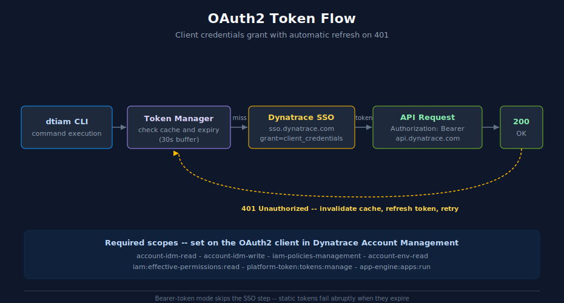

# Quick Start Guide

> **DISCLAIMER:** This tool is provided "as-is" without warranty. Use at your own risk. This is an independent, community-developed tool and is **NOT produced, endorsed, or supported by Dynatrace**.

This guide walks you through setting up dtiam and performing common IAM management tasks.

## Prerequisites

- Go 1.22+ (for building from source) or pre-built binary
- Dynatrace account with Account Management API access
- Authentication credentials (choose one):
  - **OAuth2 client credentials** (recommended for automation)
  - **Bearer token** (for quick testing/interactive use)

## Installation

### From Source

```bash
# Clone the repository
git clone https://github.com/timstewart-dynatrace/GO-dtiam.git
cd GO-dtiam

# Build the binary
make build

# The binary is created at ./bin/dtiam
./bin/dtiam --version

# Or install to $GOPATH/bin
make install
dtiam --version
```

### From Releases

Download the latest release for your platform from the [releases page](https://github.com/timstewart-dynatrace/GO-dtiam/releases).

```bash
# Linux/macOS - make executable
chmod +x dtiam
./dtiam --version

# Move to PATH
sudo mv dtiam /usr/local/bin/
```

## Authentication

dtiam supports two authentication methods:

### Option 1: OAuth2 Client Credentials (Recommended)

**Best for:** Automation, scripts, CI/CD, long-running processes

OAuth2 is the recommended authentication method because tokens automatically refresh when expired, making it reliable for unattended operation.



<!-- MARKDOWN_TABLE_ALTERNATIVE
| Step | Component | Action |
|------|-----------|--------|
| 1 | dtiam CLI | Command executes; needs Authorization header |
| 2 | Token Manager | Check in-memory cache; treat tokens within 30s of expiry as expired |
| 3 | Dynatrace SSO | `POST sso.dynatrace.com/sso/oauth2/token`, `grant_type=client_credentials` |
| 4 | API Request | Call `api.dynatrace.com/iam/v1/...` with `Authorization: Bearer <token>` |
| 5 | 401 response | Invalidate cached token, refetch from SSO, retry the original request |

Bearer-token mode skips step 3 — tokens do not refresh and fail abruptly when they expire.
-->


#### Required OAuth2 Scopes

Your OAuth2 client needs the following scopes for full functionality:

| Scope | Purpose |
|-------|---------|
| `account-idm-read` | List and describe groups, users, bindings |
| `account-idm-write` | Create, update, delete groups, users, and bindings |
| `iam-policies-management` | Manage policies |
| `account-env-read` | List environments |

#### Step 1: Create OAuth2 Credentials

1. Go to Account Management → Identity & access management → OAuth clients
2. Create a new client with the required scopes
3. Save the client ID and secret

#### Step 2: Configure dtiam (Config File Method)

```bash
# Add your credentials
dtiam config set-credentials myaccount \
  --client-id dt0s01.YOUR_CLIENT_ID \
  --client-secret dt0s01.YOUR_CLIENT_ID.YOUR_SECRET

# Create a context pointing to your account
dtiam config set-context myaccount \
  --account-uuid YOUR_ACCOUNT_UUID \
  --credentials-ref myaccount

# Activate the context
dtiam config use-context myaccount
```

#### Alternative: Environment Variables (OAuth2)

```bash
export DTIAM_CLIENT_ID="dt0s01.YOUR_CLIENT_ID"
export DTIAM_CLIENT_SECRET="dt0s01.YOUR_CLIENT_ID.YOUR_SECRET"
export DTIAM_ACCOUNT_UUID="YOUR_ACCOUNT_UUID"
```

### Option 2: Bearer Token (Static)

**Best for:** Quick testing, debugging, interactive sessions, one-off operations

> ⚠️ **WARNING:** Bearer tokens do NOT auto-refresh. When the token expires, all requests will fail with 401 Unauthorized. This method is NOT recommended for automation or scripts.

```bash
# Set bearer token via environment variable
export DTIAM_BEARER_TOKEN="dt0c01.YOUR_TOKEN_HERE..."
export DTIAM_ACCOUNT_UUID="YOUR_ACCOUNT_UUID"

# Run commands (token will be used until it expires)
dtiam get groups
```

**Risks of Bearer Token Authentication:**
- ❌ No automatic token refresh
- ❌ Silent failures when token expires
- ❌ Not suitable for automation
- ❌ Requires manual token renewal

### Authentication Priority

When multiple methods are configured, dtiam uses this priority:
1. `DTIAM_BEARER_TOKEN` + `DTIAM_ACCOUNT_UUID`
2. `DTIAM_CLIENT_ID` + `DTIAM_CLIENT_SECRET` + `DTIAM_ACCOUNT_UUID`
3. Config file context

### Verify Configuration

```bash
# View current configuration
dtiam config view

# Test connectivity by listing environments
dtiam get environments
```

## Common Tasks

### Listing Resources

```bash
# List all groups
dtiam get groups

# List with JSON output
dtiam get groups -o json

# List with additional columns
dtiam get groups -o wide

# Get a specific group
dtiam get groups "DevOps Team"
```

### Viewing Resource Details

```bash
# Describe a group (by name or UUID)
dtiam describe group "DevOps Team"

# Describe shows:
# - Basic info (UUID, name, description)
# - Member count and list
# - Assigned policies

# Describe a policy
dtiam describe policy "admin-policy"

# Describe a user
dtiam describe user admin@company.com
```

### Creating Resources

#### Create a Group

```bash
# Simple group creation
dtiam create group --name "Platform Team"

# With description
dtiam create group \
  --name "Platform Team" \
  --description "Platform engineering team"

# Preview without creating (dry-run)
dtiam --dry-run create group --name "Test Group"
```

#### Create a Policy Binding

```bash
# Assign a policy to a group
dtiam create binding \
  --group "Platform Team" \
  --policy "developer-policy"

# With boundary restriction
dtiam create binding \
  --group "Platform Team" \
  --policy "admin-policy" \
  --boundary "production-boundary"
```

### Deleting Resources

```bash
# Delete a group (with confirmation)
dtiam delete group "Test Group"

# Skip confirmation
dtiam delete group "Test Group" --force

# Delete a binding
dtiam delete binding \
  --group "Platform Team" \
  --policy "developer-policy"
```

### User Management

```bash
# Create a new user
dtiam user create user@example.com

# Create with name and groups
dtiam user create user@example.com \
  --first-name John \
  --last-name Doe \
  --groups "DevOps Team,Platform Team"

# Add a user to groups
dtiam user add-to-groups user@example.com --groups "DevOps Team"

# Remove from groups
dtiam user remove-from-groups user@example.com --groups "DevOps Team"

# List user's groups
dtiam user list-groups user@example.com

# Replace all group memberships
dtiam user replace-groups user@example.com --groups "NewTeam,AnotherTeam"
```

### Service User Management

Service users are OAuth clients used for programmatic API access.

```bash
# List all service users
dtiam service-user list

# Create a service user (SAVE THE CREDENTIALS!)
dtiam service-user create --name "CI Pipeline"

# Create with groups
dtiam service-user create \
  --name "CI Pipeline" \
  --description "CI/CD automation" \
  --groups "DevOps,Automation"

# View service user details
dtiam service-user get "CI Pipeline"

# Update a service user
dtiam service-user update "CI Pipeline" --description "Updated description"

# Add to group
dtiam service-user add-to-group "CI Pipeline" --group DevOps

# Remove from group
dtiam service-user remove-from-group "CI Pipeline" --group DevOps

# List groups
dtiam service-user list-groups "CI Pipeline"

# Delete a service user
dtiam service-user delete "CI Pipeline"
```

### Account Information

View account limits and subscription information.

```bash
# View account limits and quotas
dtiam account limits

# List subscriptions
dtiam account subscriptions

# Get usage forecast
dtiam account forecast
```

## Advanced Operations

### Group Operations

```bash
# List members of a group
dtiam group members "DevOps Team"

# Add a member to a group
dtiam group add-member "DevOps Team" --email user@example.com

# Remove a member from a group
dtiam group remove-member "DevOps Team" --user user-uid

# List policy bindings for a group
dtiam group bindings "DevOps Team"
```

### Boundary Management

```bash
# Attach a boundary to a binding
dtiam boundary attach \
  --group "DevOps Team" \
  --policy "admin-policy" \
  --boundary "production-boundary"

# Detach a boundary
dtiam boundary detach \
  --group "DevOps Team" \
  --policy "admin-policy" \
  --boundary "production-boundary"

# List all bindings using a boundary
dtiam boundary list-attached "production-boundary"
```

## Output Formats

dtiam supports multiple output formats:

| Format | Flag | Description |
|--------|------|-------------|
| Table | `-o table` | Human-readable tables (default) |
| JSON | `-o json` | JSON for programmatic use |
| YAML | `-o yaml` | YAML for configuration files |
| CSV | `-o csv` | CSV for spreadsheets |
| Wide | `-o wide` | Table with additional columns |

### Examples

```bash
# JSON output for scripting
dtiam get groups -o json | jq '.[].name'

# YAML for backup
dtiam get policies -o yaml > policies.yaml

# CSV for Excel
dtiam get users -o csv > users.csv
```

## Working with Multiple Accounts

### Configure Multiple Contexts

```bash
# Production account
dtiam config set-credentials prod \
  --client-id dt0s01.PROD_ID \
  --client-secret dt0s01.PROD_ID.PROD_SECRET

dtiam config set-context production \
  --account-uuid PROD_UUID \
  --credentials-ref prod

# Development account
dtiam config set-credentials dev \
  --client-id dt0s01.DEV_ID \
  --client-secret dt0s01.DEV_ID.DEV_SECRET

dtiam config set-context development \
  --account-uuid DEV_UUID \
  --credentials-ref dev
```

### Switch Contexts

```bash
# Switch default context
dtiam config use-context production

# One-time context override
dtiam --context development get groups

# Check current context
dtiam config get-contexts
```

## Troubleshooting

### Enable Verbose Output

```bash
dtiam -v get groups
```

This shows:
- API requests and responses
- Token acquisition details
- Timing information

### Dry Run Mode

Preview changes without applying:

```bash
dtiam --dry-run create group --name "Test"
dtiam --dry-run delete group "Old Group"
```

### Common Errors

**Authentication Failed**
```
Error: Failed to acquire OAuth token
```
- Verify client ID and secret
- Check OAuth2 scopes
- Ensure credentials-ref matches a valid credential

**Resource Not Found**
```
Error: Group 'XYZ' not found
```
- Check spelling and case sensitivity
- Use `dtiam get groups` to list available groups
- Try using UUID instead of name

**Permission Denied**
```
Error: 403 Forbidden
```
- Verify OAuth2 scopes include required permissions
- Check if resource is in a different environment

### Reset Configuration

```bash
# View config file location
dtiam config view

# Remove configuration
rm -rf ~/.config/dtiam
```

## Next Steps

- [Command Reference](COMMANDS.md) - Complete command documentation
- [Architecture](ARCHITECTURE.md) - Technical implementation details
- [API Reference](API_REFERENCE.md) - Programmatic usage guide
